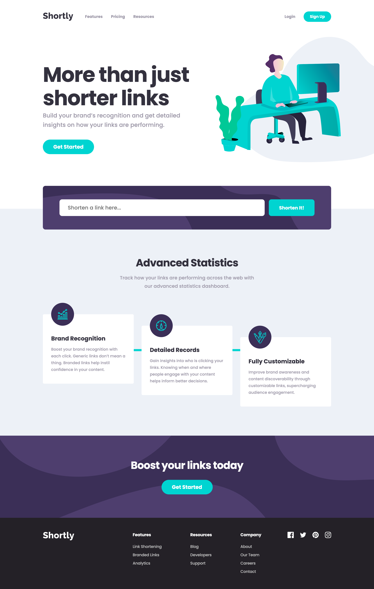

# Frontend Mentor - Shortly URL shortening API Challenge solution

This is a solution to the [Shortly URL shortening API Challenge challenge on Frontend Mentor](https://www.frontendmentor.io/challenges/url-shortening-api-landing-page-2ce3ob-G). Frontend Mentor challenges help you improve your coding skills by building realistic projects.

## Table of contents

- [Overview](#overview)
  - [The challenge](#the-challenge)
  - [Screenshot](#screenshot)
  - [Links](#links)
- [My process](#my-process)
  - [Built with](#built-with)
  - [Useful resources](#useful-resources)
- [Author](#author)

## Overview

### The challenge

Users should be able to:

- View the optimal layout for the site depending on their device's screen size
- Shorten any valid URL
- See a list of their shortened links, even after refreshing the browser
- Copy the shortened link to their clipboard in a single click
- Receive an error message when the `form` is submitted if:
  - The `input` field is empty

### Screenshot
* Desktop

* Mobile

### Links

- Solution URL: [URL Shortening API Landing Page using NextJS](https://www.frontendmentor.io/solutions/url-shortening-api-landing-page-using-nextjs-yEvm-uI_J)
- Live Site URL: [URL Shortening API Landing Page](https://url-shortening-api-landing-page-hanseonglee.vercel.app)

## My process

### Built with

- Semantic HTML5 markup
- Flexbox
- CSS Grid
- Mobile-first workflow
- [React](https://reactjs.org/) - JS library
- [Next.js](https://nextjs.org/) - React framework
- [Sass/SCSS](https://sass-lang.com/) - For styles
- [Context](https://reactjs.org/docs/context.html) - For global state managements
- LocalStorage - For global state store
- [axios](https://github.com/axios/axios) - HTTP client
- [shrtcode](https://shrtco.de/) - URL Shortener API

### Useful resources

- [shrtcode API Documentation](https://shrtco.de/docs/) - This helped me for generating short urls.

## Author

- Frontend Mentor - [@HanSeongLee](https://www.frontendmentor.io/profile/HanSeongLee)
